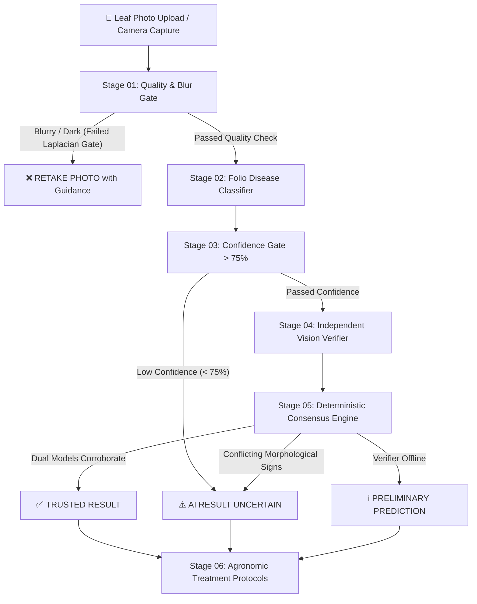

# 🌱 Kissan-AI (CropSathi) — "See. Verify. Protect."

[](LICENSE)
[](https://fastapi.tiangolo.com)
[](https://react.dev)
[](https://vitejs.dev)
[](https://tailwindcss.com)
[](https://www.python.org)

> **Next-Generation Agricultural Disease Triage Engine with Dual-Model Visual Verification & Deterministic Consensus.**  
> *Engineered by [Navin Adithya](https://github.com/NavinAdithya) — Built for high-stakes foliar pathology diagnosis.*

---

## 📖 Table of Contents
- [🌟 The Agricultural Problem](#-the-agricultural-problem)
- [⚡ The Core Innovation: 6-Stage Consensus Pipeline](#-the-core-innovation-6-stage-consensus-pipeline)
- [🧑‍⚖️ Interactive Hackathon & Demo Scenarios](#️-interactive-hackathon--demo-scenarios)
- [🛠️ Architecture & Tech Stack](#️-architecture--tech-stack)
- [📁 Project Directory Structure](#-project-directory-structure)
- [🚀 Quick Start Guide](#-quick-start-guide)
  - [Backend Setup](#1-backend-setup-fastapi)
  - [Frontend Setup](#2-frontend-setup-react--vite)
- [🔌 API Documentation](#-api-documentation)
- [🛡️ Responsible AI Agricultural Protocol](#️-responsible-ai-agricultural-protocol)
- [⚖️ Intellectual Property & License](#️-intellectual-property--license)

---

## 🌟 The Agricultural Problem

In modern precision agriculture, **false confidence is catastrophic**.

Standard crop diagnosis apps operate as single-layer black boxes:
```
PHOTO ➔ GENERIC CNN ➔ 99% CONFIDENT WRONG PREDICTION
```
When a farmer uploads a blurry photo or a confusing leaf symptom, generic AI models frequently hallucinate:
- Misdiagnosing **Early Blight** as **Late Blight** prompts farmers to spray the wrong chemical fungicides.
- Incorrect chemical application wastes hard-earned savings while allowing true pathogens to decimate hectares of crops within 48 to 72 hours.
- Blurry, dark, or out-of-focus photos are processed blindly instead of asking the farmer to retake the shot.

**Kissan-AI replaces blind predictions with verifiable, dual-model consensus triage.**

---

## ⚡ The Core Innovation: 6-Stage Consensus Pipeline

Kissan-AI enforces a deterministic, multi-barrier pipeline before delivering any agricultural verdict:



### Detailed Pipeline Breakdown

1. **Stage 01 — Optical Quality Gate (OpenCV / PIL)**:
   - Computes Laplacian variance to measure foliar edge sharpness.
   - Evaluates luminance histograms to reject severely under-exposed or over-exposed captures.
   - **Short-circuits immediately** if the photo is blurry, protecting farmers from hallucinated outputs.
2. **Stage 02 — Primary Foliar Disease Classifier**:
   - Deep CNN architecture trained on leaf pathology datasets across 38+ plant-disease pairs.
   - Extracts localized lesion textures, chlorotic halos, and necrotic spots.
3. **Stage 03 — Statistical Margin Gate**:
   - Enforces a strict 75% minimum probability threshold.
   - Prevents borderline classifications from entering verification unchecked.
4. **Stage 04 — Independent Visual Verification Engine**:
   - Powered by decoupled vision analysis / Groq Llama-3.2-Vision zero-shot inference.
   - Cross-examines specific foliar traits (e.g., concentric bullseye rings vs. water-soaked lesions).
5. **Stage 05 — Deterministic Consensus Engine**:
   - Compares classifier outputs with verifier observations.
   - Categorizes findings into **TRUSTED**, **UNCERTAIN**, or **PRELIMINARY**.
6. **Stage 06 — Curated Plant Pathology Knowledge Base**:
   - Delivers immediate organic remedies, chemical interventions, and extension officer consultation guidelines.

---

## 🧑‍⚖️ Interactive Hackathon & Demo Scenarios

Kissan-AI includes a built-in **Scenario Evaluation Switcher** and **Judge Mode Panel** designed for rapid evaluation of every major pipeline branch:

| Scenario | Branch Trigger | Expected Pipeline Result | Core Innovation Demonstrated |
|---|---|---|---|
| **Scenario A** | Clear Leaf Photo | **TRUSTED RESULT** | AI Classifier (91%) + Vision Verifier (93%) corroborate with zero conflict. Full agronomic protocol unlocked. |
| **Scenario B** | Blurry / Dark Photo | **RETAKE PHOTO** | Quality Gate triggers at Stage 01. Machine learning inference is withheld to prevent false hallucinations. Dynamic photo tips provided. |
| **Scenario C** | Conflicting Folio Evidence | **AI RESULT UNCERTAIN** | Classifier predicts Early Blight (89%), but Vision Engine detects Late Blight lesions. Discrepancy is flagged as an agronomic safety asset. |
| **Scenario D** | Inconclusive Leaf | **AI RESULT UNCERTAIN** | Model confidence (48%) falls below 75% threshold. System refuses to guess and recommends agricultural extension review. |
| **Scenario E** | Verifier Offline | **PRELIMINARY PREDICTION** | Verifier engine unavailable; UI clearly separates the single unverified prediction from verified consensus. |

---

## 🛠️ Architecture & Tech Stack

### Frontend
- **Framework**: React 19 (TypeScript)
- **Tooling**: Vite 8, Fast Refresh
- **Styling**: Tailwind CSS 3.4 (Custom Agricultural Design Tokens: `#0a2e22`, `#16a34a`, `#fcfbf8`)
- **Icons**: Lucide React
- **Camera Capture**: Native WebRTC Camera Stream with fallback to HTML5 File Capture (`capture="environment"`)

### Backend
- **Framework**: FastAPI (Async Python 3.10 / 3.14)
- **Server**: Uvicorn ASGI
- **Computer Vision**: OpenCV, Pillow (PIL), NumPy
- **Vision Verification**: Groq Cloud SDK (Llama-3.2-11B-Vision-Preview) / Internal Pathological Heuristic Engine
- **Data Validation**: Pydantic v2

---

## 📁 Project Directory Structure

```text
Kissan-AI/
├── LICENSE                 # Proprietary All Rights Reserved License
├── README.md               # Project Documentation
├── .gitignore              # Git Ignore configuration
├── backend/
│   ├── classifier.py       # Foliar disease classifier engine
│   ├── consensus_engine.py  # Multi-factor deterministic consensus resolver
│   ├── knowledge_base.py   # Curated plant pathology & treatment protocols
│   ├── main.py             # FastAPI application endpoints (/api/triage, /api/health)
│   ├── quality_gate.py     # Laplacian edge variance & luminance validation
│   ├── requirements.txt    # Python backend dependencies
│   └── vision_verifier.py  # Decoupled vision inspection & Groq Llama-3.2 integration
└── frontend/
    ├── index.html          # HTML5 entry with PWA viewport configuration
    ├── package.json        # Frontend scripts and dependencies
    ├── vite.config.ts      # Vite configuration
    ├── tailwind.config.js  # Tailwind theme tokens & fonts
    └── src/
        ├── App.tsx         # Main application controller & state machine
        ├── main.tsx        # Application entry point
        ├── index.css       # Design system styles & animations
        ├── api/
        │   ├── demoData.ts # Pre-configured hackathon evaluation scenarios
        │   └── triageApi.ts# REST client connecting to FastAPI backend
        ├── components/
        │   ├── AnalysisPipeline.tsx    # 6-Stage progress tracker
        │   ├── CameraUploadModal.tsx   # Mobile camera & file capture modal
        │   ├── DemoScenarioBar.tsx     # Quick switcher for demo states
        │   ├── Hero.tsx                # Hero section with primary CTA
        │   ├── HeroVisual.tsx          # Interactive pipeline preview visual
        │   ├── JudgeModePanel.tsx      # Diagnostic inspector for hackathon judges
        │   ├── Navbar.tsx              # Navigation bar with live backend status
        │   ├── ResultView.tsx          # Master result display router
        │   ├── TrustedResultCard.tsx   # Verified consensus card
        │   ├── UncertainResultCard.tsx # Conflict & low confidence card
        │   ├── RetakeQualityCard.tsx   # Photo quality gate rejection card
        │   └── ...
        └── types/
            └── triage.ts   # TypeScript interfaces for triage responses
```

---

## 🚀 Quick Start Guide

### Prerequisites
- **Node.js** (v18.0 or newer)
- **Python** (v3.10 or newer)
- **Git**

---

### 1. Backend Setup (FastAPI)

1. Open your terminal and navigate to the backend directory:
   ```bash
   cd backend
   ```
2. Create and activate a Python virtual environment:
   - **Windows**:
     ```bash
     python -m venv venv
     .\venv\Scripts\activate
     ```
   - **macOS / Linux**:
     ```bash
     python3 -m venv venv
     source venv/bin/activate
     ```
3. Install dependencies:
   ```bash
   pip install -r requirements.txt
   ```
4. *(Optional)* Set your Groq API key for live Llama-3.2 Vision verification:
   ```bash
   # Windows (PowerShell)
   $env:GROQ_API_KEY="your_groq_api_key_here"

   # macOS / Linux
   export GROQ_API_KEY="your_groq_api_key_here"
   ```
   *(If omitted, Kissan-AI seamlessly runs on its internal offline pathological heuristic engine).*
5. Start the FastAPI server:
   ```bash
   python -m uvicorn main:app --host 127.0.0.1 --port 8000 --reload
   ```
6. Verify backend is running:
   - Health Check: [http://127.0.0.1:8000/api/health](http://127.0.0.1:8000/api/health)
   - Interactive Swagger Docs: [http://127.0.0.1:8000/docs](http://127.0.0.1:8000/docs)

---

### 2. Frontend Setup (React + Vite)

1. Open a new terminal and navigate to the frontend directory:
   ```bash
   cd frontend
   ```
2. Install npm dependencies:
   ```bash
   npm install
   ```
3. Start the Vite development server:
   ```bash
   npm run dev
   ```
4. Open your browser and visit:
   ```
   http://localhost:5173
   ```

---

## 🔌 API Documentation

### `GET /api/health`
Checks server readiness and status of classifier and verifier subsystems.

**Response (200 OK):**
```json
{
  "status": "ok",
  "classifier_ready": true,
  "verifier_ready": true,
  "version": "1.0.0"
}
```

---

### `POST /api/triage`
Submits a leaf photo for 6-stage triage analysis.

- **Content-Type**: `multipart/form-data`
- **Body**: `file` (Image file: JPEG, PNG, WEBP)

**Sample Success Response (`TRUSTED`):**
```json
{
  "status": "TRUSTED",
  "disease_name": "Tomato Early Blight",
  "crop": "Tomato",
  "pathogen": "Alternaria solani",
  "classifier_confidence": 91.2,
  "verification_confidence": 93.0,
  "quality_score": 88.5,
  "observed_symptoms": [
    "Concentric dark rings (target-like pattern)",
    "Chlorotic yellow margin around necrotic lesions",
    "Foliar leaf spot progression from lower canopy"
  ],
  "contradictions": [],
  "treatment": {
    "organic": "Apply copper-based fungicide or Bacillus subtilis biopesticide.",
    "chemical": "Chlorothalonil or Mancozeb preventative application.",
    "cultural": "Prune lower infected foliage and irrigate at ground level."
  },
  "processing_time_ms": 340,
  "timestamp": "2026-10-05T13:30:00Z"
}
```

---

## 🛡️ Responsible AI Agricultural Protocol

> **Ethical & Safety Notice**:  
> Kissan-AI provides automated agronomic triage and decision support, not an irreversible legal diagnosis. When foliar symptoms are ambiguous or contradictory, the platform deliberately withholds false certainty and directs farmers to retake higher-quality photographs or consult certified agricultural extension officers.

---

## ⚖️ Intellectual Property & License

**PROPRIETARY AND CONFIDENTIAL — ALL RIGHTS RESERVED**  
**Copyright © 2025–2026 [Navin Adithya](https://github.com/NavinAdithya). All Rights Reserved.**

This repository, its underlying algorithms, dual-model consensus architecture, heuristics, workflows, and source code are the sole intellectual property of **Navin Adithya**.

- **No Copying or Duplication**: No individual or organization may copy, duplicate, or reproduce any portion of this codebase or architecture without prior express written permission.
- **No Derivative Works or Idea Theft**: Creating derivative works, competing clones, academic plagiarism, or replicating the multi-barrier consensus pipeline is strictly prohibited.
- **No Unauthorized Commercial or Public Deployment**: Hosting, distributing, or utilizing this software without an explicit written license agreement from the author is strictly disallowed.

For full legal terms, refer to the [LICENSE](LICENSE) file.

---

<p align="center">
  <b>Developed with ❤️ for farmers by <a href="https://github.com/NavinAdithya">Navin Adithya</a></b><br>
  <i>"See. Verify. Protect."</i>
</p>
